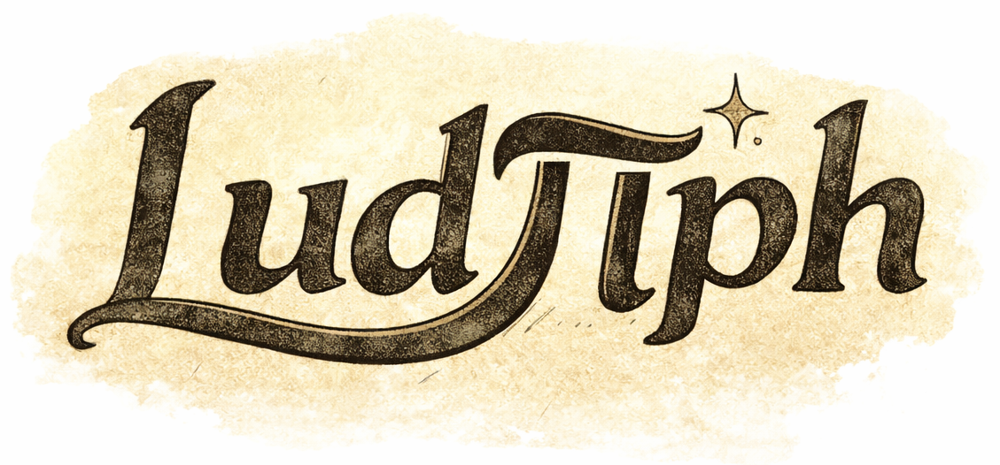
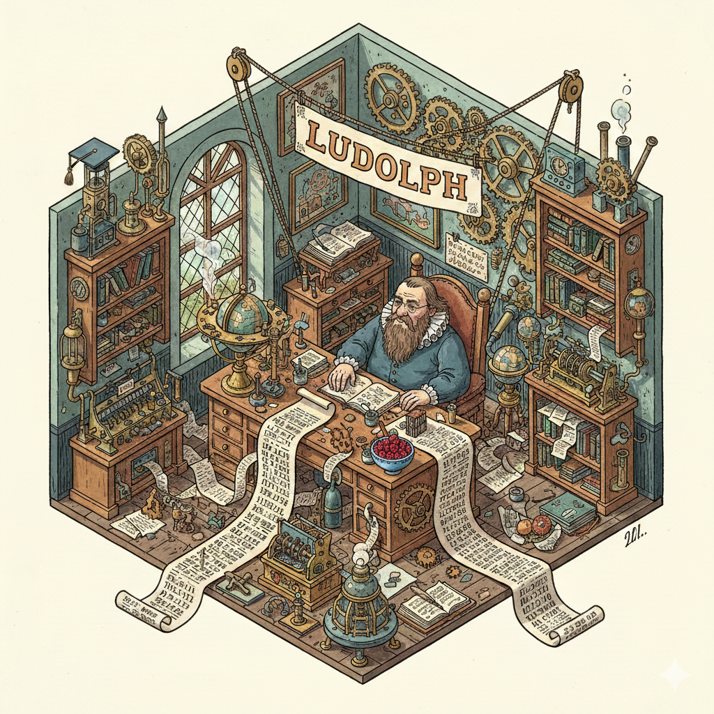

<p style="background:#fbf4d2;font-weight:bold;padding:1rem;margin:0 0 2rem;" align="center">
Ludolph is grumpy and is currently under active development.<br/>
Please check back in roughly 3.14 months, give or take a few decimals.
</p>

<p>
<strong>A real brain for your second brain.</strong><br>
Your vault is the context. Talk to it, anywhere, anytime. 
</p>

---



Ludolph is a self-hosted Telegram bot that lets you chat with Claude about your Obsidian vault. It runs on a Raspberry Pi (or any always-on machine) with full access to your notes — so you can search, summarize, create, and edit from anywhere, at any ungodly hour.

**Ok, why Ludolph?** Tools like [OpenClaw](https://openclaw.ai/) are equal measures fun and a wee bit scary, toting full-featured AI agents who may or may not desire to drain your blood while you're sleeping. Browser control, shell access, dozens of app integrations: if that's what you need, go use OpenClaw. It's great.

But Ludolph is for people who just want to talk to their notes. No skill configs, no system files, no dedicated Mac Mini. Just a Telegram bot, a Pi, and your vault. The goal is something your non-technical friend could set up in an afternoon, though he'll probably call you for help anyways.

That said, if you are a power user (and you probably are, since Obsidianites tend to use Obsidian for everything short of shaving their neckbeard and drying their underwear), Ludolph is just as configurable under the hood. And because your vault is your entire system (tasks, journals, projects, contacts, reference, whatever you've crammed in there), Claude gets full context on how you actually think and work. No separate memory files, no syncing a knowledge base. Your vault is the brain. So, take it with you from time to time.

## Features

- **Sandboxed** — Ludolph can't touch anything outside your vault. The blast radius of a hallucination is a bad markdown file, not an e-mail to your nasty ex-partner or a delightful tango with `rm -rf /`
- **Revision history** — Every change Claude makes is a file edit, tracked in source control. Full diffs on everything it touches or you touch. Don't like some change? Revert it, or ask Ludolph to help you revert it. Or just ask Ludolph what changes have been made, by whom, and when
- **Knows Obsidian** — Dataview syntax, Tasks plugin formatting, Templater patterns, YAML frontmatter, wikilinks, callouts. Ludolph doesn't dump text into files — it writes markdown your plugins already understand
- **Learns your vault** — On first run, Ludolph scans your folder structure, frontmatter schema, tag taxonomy, and templates. When it creates a note, it creates it the way _you_ create notes. And it summarizes your notes in a way that **you** can literally review and modify within your vault
- **Fast** — Written in Rust. Starts instantly, idles at ~2MB of RAM, and won't break a sweat on a Raspberry Pi Zero
- **Always on** — Runs on a Raspberry Pi, answers via Telegram from anywhere
- **Two-way sync** — Edit a note on your laptop, ask Ludolph about it from your phone a minute later. Changes flow both ways, so your vault is always current wherever you are
- **Single binary** — No Python, no Node, no dependencies. Download and run
- **Your API key** — You control costs, models, and data
- **Configurable** — Sensible defaults out of the box, but everything's tunable if you want it to be
- **No knowledge base to sync** — Your vault is the context. Claude sees how you actually organize and think

## Quick Start


As much as we'd love to spend thousands of dollars on an overpriced Mac in our quest to poorly automate four or five of our emails (all while destroying the planet with our power-sucking data center proxies), a $35 Raspberry Pi will do the job just fine — and with the smug satisfaction of running your personal AI butler on something the size of a deck of cards. Is the world still over? Probably. But at least you can take great notes about it.

### 1. Get a Raspberry Pi

Grab a [CanaKit Raspberry Pi 5](https://www.canakit.com/raspberry-pi-5.html) or any Pi you have lying around. New to Pi? Follow the official [Getting Started guide](https://www.raspberrypi.com/documentation/computers/getting-started.html) to flash Raspberry Pi OS and get connected to your network.

### 2. Set up remote access

Install [Tailscale](https://tailscale.com/) on both the Pi and your main machine so you can reach your Pi from anywhere safely. New to Tailscale? It's free for personal use and takes about [two minutes to set up](https://tailscale.com/kb/1017/install).

On your Pi:
```bash
curl -fsSL https://tailscale.com/install.sh | sh
sudo tailscale up
```

On your Mac:
```bash
brew install tailscale
```

### 3. Run the installer on your Mac

The installer runs on your Mac (where your vault already lives) and handles everything:

```bash
curl -sSL https://ludolph.dev/install | bash
```

It will:
- Find your Obsidian vault
- Optionally scan for sensitive files (API keys, passwords) to exclude
- Set up automatic backups through GitHub
- Connect to your Pi and install Ludolph
- Sync your vault to the Pi
- Configure the Telegram bot

You'll need two API keys during setup:
- **Telegram Bot Token** — Create one at [t.me/BotFather](https://t.me/BotFather)
- **Claude API Key** — Get one at [console.anthropic.com](https://console.anthropic.com)

### 4. Start talking

Open [Telegram](https://telegram.org/) — a free, cross-platform messaging app that supports bots natively (which is why we use it instead of iMessage or WhatsApp). Message your bot. You're in.

Edit a note on your Mac, and within a few minutes your Pi will have it. Ask Ludolph about your notes from anywhere in the world.

[TODO: ADD DEMO CHAT HERE]

## CLI Commands

```bash
lu               # Start the bot
lu setup         # Run setup wizard
lu config        # Open config in editor
lu pi            # Check Pi connectivity
```

## Configuration

Config lives at `~/.ludolph/config.toml`:

```toml
[telegram]
bot_token = "your-telegram-bot-token"
allowed_users = [123456789]

[claude]
api_key = "your-anthropic-api-key"
model = "claude-sonnet-4-20250514"

[vault]
path = "/path/to/your/vault"
```

<br clear="right">

## Building from Source

```bash
git clone https://github.com/evannagle/ludolph
cd ludolph
cargo build --release
```

Pre-built binaries for Linux (x86, ARM), macOS (Intel, Apple Silicon) are available on the [releases page](https://github.com/evannagle/ludolph/releases).

See [CONTRIBUTING.md](CONTRIBUTING.md) for development setup, architecture notes, and how to submit a PR.

<br clear="right">

## See Also

- [OpenClaw](https://openclaw.ai/) — Full-featured open-source AI agent with browser control, shell access, and 50+ integrations
- [Khoj](https://khoj.dev/) — AI personal assistant with Obsidian integration
- [Obsidian Copilot](https://github.com/logancyang/obsidian-copilot) — AI plugin that runs inside Obsidian

## Named After

[Ludolph van Ceulen](https://en.wikipedia.org/wiki/Ludolph_van_Ceulen) (1540–1610), the mathematician who spent 25 years calculating pi to 35 decimal places. He had the digits engraved on his tombstone. We named a Telegram bot after him. He would be furious.

> 3.14159265358979323846264338327950288

## License

[MIT](LICENSE) — do whatever you want with it.
